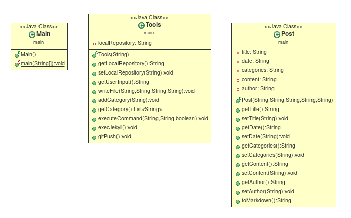

# project-ACDC

## Site web statique dynamique ##

*Ce projet est réalisé dans le cadre d'un projet de première année (SEMESTRE 1) en tant qu'ingénieur logiciel à l'IMT ATLANTIQUE (France, Nantes).*

**********

## A propos du projet ##
### Présentation ###
Le but du projet est de pouvoir facilement ajouter de nouveaux articles sur un site web utilisant jekyll (plus d'informations sur https://jekyllrb.com).

J'ai choisi d'implémenter une solution qui se base sur le diagramme de classe suivant : 



On y retrouve donc :
- une classe `Main` dans laquelle se trouvent la méthode `main`, les différents appels aux méthodes implémentées dans les deux autres classes sont fait dans celle-ci. 
- une classe `Tools` qui fournit l'ensemble des méthodes permettant de gérer notre programme, comme par exemple la méthode qui permet d'écrire un fichier, ou celle permettant d'exécuter une méthode...
- une classe `Post` dans laquelle on stocke les différentes informations liées au nouveau poste créé comme par exemple son titre, son auteur, son contenu...

**********

### Mise en place ###
Afin que tout fonctionne correctement il faudra lier votre dépôt github correspondant à votre pc à l'aide d'une clé ssh. Pour se faire, suivre les étapes énnoncées dans la partie [Set up 'git push' with an ssh key](#ssh-key).

Une fois cela fait et le dépôt cloné sur votre machine, vous avez deux choix : 
- run le programme `addPost.jar` depuis un terminal (à l'aide de la commande : `java -jar addPost.jar`)
- ouvrir le projet dans un IDE et le lancer depuis cet IDE en effectuant les changements mentionnés dans la partie [Configurer le programme pour son propre pc](#configure-your-project).

**********

### Configurer le programme pour son propre pc ### {#configure-your-project}
__Premièrement :__ il faudra commenter les lignes indiquées dans les commentaires des classes `Main` et `Tools` (lignes utilisées pour le fonctionnement du fichier .jar) et dé-commenter les lignes indiquées (afin de définir le 'path' pour un fonctionnement dans le terminal d'eclipse).

__Deuxièmement :__ définir un chemin adéquat dans l'objet `Tools outil` créé dans la classe `Main` permettant au programme de se rendre dans le dossier `your-path-from-home/project-ACDC/BLOG/`.

Vous pouvez désormais lancer le programme, celui-ci fonctionnera correctement si vous avez bien installé jekyll et bien rentré une clé ssh pour votre dépôt GitHub.

**********

### Set up 'git push' with an ssh key ###
Create a repo.
Make sure there is at least one file in it (even just the README)
Generate ssh key:
```
ssh-keygen -t rsa -C "your_email@example.com"
```
Copy the contents of the file ~/.ssh/id_rsa.pub to your SSH keys in your GitHub account settings.
Test SSH key:
```
ssh -T git@github.com
clone the repo:
git clone git://github.com/username/your-repository
```
Now cd to your git clone folder and do:
```
git remote set-url origin git@github.com:username/your-repository.git
```
Now try editing a file (try the README) and then do:

```
git add -A
git commit -am "my update msg"
git push
```

**********

### Logs ###
__10/10/2018 :__
Première réunion avec le groupe travaillant sur le projet. Analyse et compréhension du sujet + première mise en place d’un diagramme UML. Également, un petit travail de documentation sur les outils Git et Jekyll ainsi que sur le langage Markdown. Première réunion avec le professeur référent organisée pour le 11/10/2018.

__17/10/2018 :__
Mise en place de la création du fichier .markdown.

__24/10/2018 :__
Documentation et étude sur la mise en place des commandes `bundle exec jekyll serve -o`, `git add .`, `git commit -m "..."`, `git push`.

__31/10/2018 :__
Validation d'une API commune au groupe de travail et dépôt du premier rendu sur le site intranet de l'école. La commande `bundle exec jekyll serve -o` devrait marcher mais je n'arrive pas à la lancer depuis eclipse. 

__07/11/2018 :__
Une réunion avec le groupe a été faite le 06/11/2018 afin de faire un point sur ce qui a été fait, et de se mettre d’accord sur une api finale. Réalisation d'un nouveau diagramme de classe et modification du programme afin qu'il s'adapte au nouveau diagramme mit en place. 

__14/11/2018 :__
Correction du bug empêchant la commande `bundle exec jekyll serve -o` de se lancer.

__21/11/2018 :__
Mise en place et test des commandes permettant de `git push` et documentation du programme sur le dépôt GitHub. Tout fonctionne correctement, le programme peut être utilisé par n'importe qui. 
